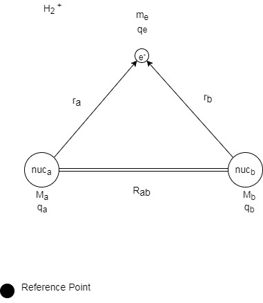

[home](/README.md)



## Born-Oppenheimer Approximation

 

 How can we calculate the energy of this system? 
 
In the model depicted above, a system composed of three bodies is depicted. In order to calculate the total energy of the system, the interactions between the three different bodies, Nucleus A, Nucleus B, and the electron must be considered. Three-body problems are unable to computationally solved, but the Born-Oppenheimer approximation introduces a simplification which allows for the energy of the system to be determined. 

The Born-Oppenheimer Approximation states that because the mass of a nucleus is so much larger than the mass of an electron, on the time-scale of the motion of an electron, the nucleus can be treated as stationary. In reality, the nucleus is not stationary, but on the electron time-scale, the electron state does not change appreciably with the changing position of the nucleus. 

While it has been established that the electron state depends parametrically on the location of the nucleus, the Born-Oppenheimer Approximation allows for a simplification of the Hamiltonian describing the energy of an electron and two nuclei. 

The Hamiltonian to describe the overall system consisting of two different nuclei and one electron, an {H_2^+} system, can be broken down into two different functions - one that depends on the separation between the two nuclei, and one that depends on the distance of the electron from the nuclei. This electronic function will also depend parametrically on the nucleus-nucleus distance. 

The Hamiltonian must describe both the translational motion of the electron and nuclei in the system as well as the potential interactions between them. The Hamiltonian is then composed of both the potential and kinetic energies of the nuc-nuc interactions and the nucleus-electron interactions: 

By diving by $\psi * \chi$, the functions which don't depend on r or R can then be canceled out and the expression can be simplified. The product rule can then be used to further simplify the expression of the kinetic energy of nuclei A and B by taking the second derivative of the functions. 

When everything is simplified down as much as possible, the end result is a total potential function which depends on both the repulsion of the two nuclei as well as the attraction between the nuclei and the electron.

source: https://www.physicsforums.com/threads/why-does-the-potential-energy-get-lower-as-atoms-get-closer.897854/

In the graph above, the total potential energy of a system is depicted by changing the internuclear distance. The graph can be thought of as  a collection of electronic energy calculations made by changing the position of the reduced mass of the nuclei and then adding an electron to the system and calculating the energy of the electron. By using the reduced mass of the nuclei, one nucleus can be thought of as stationary. The minimum energy depicted on the graph is reflective of the equilibrium bond length on the r axis and the energy of the bond on the E axis. The energy of the electron at these different nucelar positions ends up determining the total potential energy of the system. 

When the electronic energy is calculated, the total potential energy ends up being calculated. 

